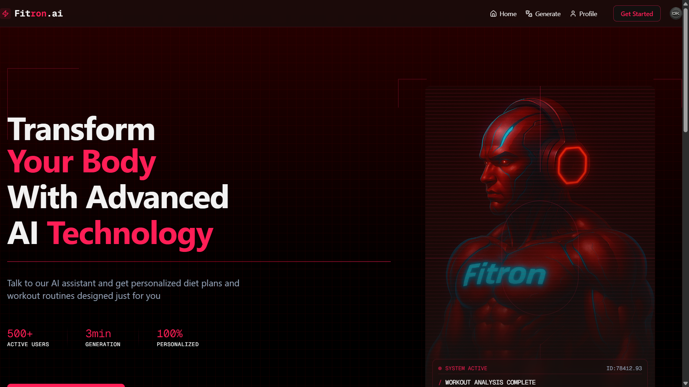

# Fitron-AI

Fitron-AI is a modern fitness AI platform designed to help you get jacked for free. Leverage AI-powered workout plans, personalized recommendations, and a sleek interface to achieve your fitness goals.

## Preview Images

## Highlights:

- Tech stack: Next.js, React, Tailwind & Shadcn UI
- Voice AI Assistant (Vapi)
-  LLM Integration (Gemini AI)
- Personalized Workout Plans
-  Custom Diet Programs
-  Authentication & Authorization (Clerk)
-  Database (Convex)
-  Real-time Program Generation
-  Layouts
-  Client & Server Components
## Technologies Used

- **Next.js**: React framework for building the frontend and API routes
- **Tailwind CSS & Shadcn UI**: For styling and UI components
- **Clerk**: Authentication and user management
- **Vapi**: Voice agent platform for conversational AI
- **Convex**: Real-time database
- **Gemini AI**: Large Language Model for generating personalized fitness programs# Fitron.AI

